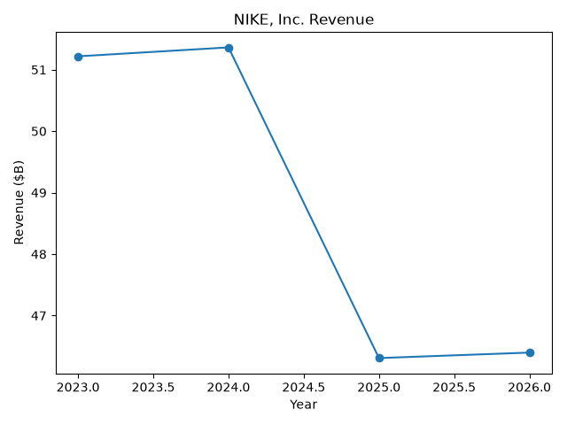
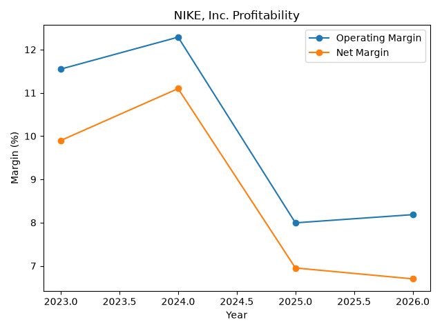

# Automated Equity Research Engine

A Python-based equity research workflow that combines financial statement analysis, SEC 10-K research, valuation modeling, data visualization, and AI-assisted report generation.

The project was built to automate much of the initial research process used when analyzing a publicly traded company.

---

## Overview

The Automated Equity Research Engine allows a user to enter a stock ticker and automatically performs a multi-step equity research workflow.

Example:

```text
Enter stock ticker: NKE
```

The engine then:

1. Retrieves company financial data
2. Pulls historical financial statements
3. Calculates financial ratios and profitability metrics
4. Analyzes multi-year financial trends
5. Retrieves the company's latest SEC 10-K filing
6. Downloads and processes the filing
7. Extracts Risk Factors and Management's Discussion & Analysis
8. Retrieves valuation multiples
9. Runs an illustrative discounted cash flow valuation
10. Generates financial charts
11. Uses AI to synthesize the quantitative and qualitative information
12. Produces a structured equity research report
13. Automatically saves the completed report

---

## Core Features

### Financial Statement Analysis

The engine analyzes:

- Revenue
- Revenue growth
- Operating income
- Net income
- EBITDA
- Operating margin
- Net margin
- EBITDA margin
- Operating cash flow
- Free cash flow

This allows the program to identify changes in growth, profitability, and cash generation across multiple fiscal years.

---

### Financial Health Analysis

The engine calculates:

- Cash
- Total debt
- Net debt
- Free cash flow margin
- Debt / EBITDA
- Cash / Debt

These metrics help evaluate the company's liquidity, leverage, and financial flexibility.

---

## SEC 10-K Analysis

The project connects to SEC EDGAR and automatically identifies the company's latest available 10-K filing.

The filing is downloaded and converted from HTML into readable text.

The engine then attempts to extract:

### Item 1A — Risk Factors

Used to identify major operational, financial, regulatory, competitive, and macroeconomic risks disclosed by the company.

### Item 7 — Management's Discussion & Analysis

Used to analyze management's discussion of:

- Financial performance
- Business trends
- Strategy
- Profitability
- Operating conditions
- Risks
- Future priorities

The extracted filing information is then incorporated into the final equity research analysis.

---

## Valuation Multiples

The program retrieves several commonly used valuation metrics:

- Trailing P/E
- Forward P/E
- Price / Sales
- EV / EBITDA

Example:

```text
--- VALUATION MULTIPLES ---
Trailing P/E: 17.33x
Forward P/E: 15.90x
Price / Sales: 1.16x
EV / EBITDA: 11.56x
```

---

## Discounted Cash Flow Valuation

The project includes a simplified five-year discounted cash flow model.

The model:

1. Uses current free cash flow as the starting point
2. Projects free cash flow over five years
3. Discounts projected cash flows using a WACC assumption
4. Calculates terminal value using the Gordon Growth Model
5. Discounts terminal value to present value
6. Calculates enterprise value
7. Adjusts for cash and debt
8. Calculates equity value
9. Divides equity value by shares outstanding
10. Estimates intrinsic value per share
11. Compares estimated value with the current share price

Current default assumptions:

```text
Forecast Period: 5 years
Free Cash Flow Growth: 5.0%
WACC: 9.0%
Terminal Growth Rate: 2.5%
```

These assumptions are illustrative model inputs and are not management forecasts.

---

## Example DCF Output

Example from an NKE analysis:

```text
--- DCF VALUATION ---
Base Free Cash Flow: $1.89B
Forecast Period: 5 years
FCF Growth Assumption: 5.00%
Discount Rate / WACC: 9.00%
Terminal Growth Rate: 2.50%
DCF Enterprise Value: $33.17B
DCF Equity Value: $31.15B
Estimated Intrinsic Value: $25.91 per share
Current Price: $36.40
Implied Upside / Downside: -28.80%
```

The result is highly dependent on the assumptions used and should not be interpreted as a guaranteed fair value or future stock price.

---

## Financial Visualizations

The engine automatically creates charts for each analyzed company.

### Revenue Trend



### Profitability Trend



The charts are generated automatically using historical company financial data.

---

## AI-Assisted Equity Research

The project combines quantitative financial data with qualitative SEC filing information.

The AI receives:

- Historical revenue
- Profitability metrics
- Cash flow data
- Balance sheet metrics
- Financial ratios
- Valuation multiples
- DCF results
- SEC Risk Factors
- SEC Management Discussion & Analysis

It then produces a structured equity research report.

The report includes:

1. Executive Summary
2. Revenue Trend
3. Profitability Trend
4. Margin Analysis
5. Cash Flow
6. Balance Sheet and Liquidity
7. Management Commentary
8. Major 10-K Risk Factors
9. Financial Strengths
10. Financial Risks
11. Valuation Multiples
12. DCF Valuation
13. Bull Case
14. Bear Case
15. Key Catalysts
16. Overall Investment View

The model is instructed not to invent financial numbers or company facts and to distinguish between financial-data conclusions and statements derived from SEC filings.

---

## Automated Research Reports

Each completed analysis automatically creates a Markdown equity research report.

Example:

```text
reports/NKE_equity_research_report.md
```

The report contains:

- Company snapshot
- Financial snapshot
- Historical performance
- Financial health metrics
- Valuation multiples
- DCF valuation
- Management commentary
- SEC risk analysis
- Financial strengths
- Financial risks
- Bull case
- Bear case
- Key catalysts
- Overall investment view
- Methodology
- Disclaimer

---

## Project Workflow

```text
Stock Ticker
      ↓
Market & Financial Data
      ↓
Financial Statements
      ↓
Financial Ratios
      ↓
Historical Trend Analysis
      ↓
SEC EDGAR
      ↓
Latest 10-K
      ↓
Risk Factors + MD&A
      ↓
Valuation Multiples
      ↓
DCF Valuation
      ↓
Financial Charts
      ↓
AI-Assisted Research
      ↓
Automated Equity Research Report
```

---

## Project Structure

```text
automated-equity-research-engine/
│
├── main.py
├── README.md
├── requirements.txt
├── .gitignore
│
├── charts/
│   ├── NKE_revenue.png
│   └── NKE_margins.png
│
└── reports/
    └── NKE_equity_research_report.md
```

The local development environment also uses:

```text
.env
.venv/
```

These files are excluded from GitHub using `.gitignore`.

---

## Technologies Used

### Python

Core programming language used to build the application.

### yfinance

Used to retrieve:

- Company information
- Financial statements
- Market capitalization
- Share price
- Cash
- Debt
- Cash flow
- Shares outstanding
- Valuation multiples

### SEC EDGAR

Used to retrieve official company 10-K filings.

### Requests

Used to send HTTP requests to SEC endpoints and retrieve filing data.

### BeautifulSoup

Used to parse SEC filing HTML and convert it into readable text.

### Matplotlib

Used to automatically generate financial charts.

### OpenAI API

Used to synthesize financial information and SEC disclosures into a structured equity research narrative.

### python-dotenv

Used to load environment variables securely.

---

## Installation

Clone the repository:

```bash
git clone https://github.com/chopraisheen-ctrl/automated-equity-research-engine.git
```

Enter the project folder:

```bash
cd automated-equity-research-engine
```

Create a virtual environment:

```bash
python -m venv .venv
```

Activate it on Windows PowerShell:

```powershell
.\.venv\Scripts\Activate.ps1
```

Install dependencies:

```bash
pip install -r requirements.txt
```

---

## Environment Variables

Create a file named:

```text
.env
```

inside the project directory.

Add:

```text
OPENAI_API_KEY=your_openai_api_key_here
SEC_EMAIL=your_email@example.com
```

Never upload `.env` to GitHub.

The project `.gitignore` should contain:

```text
.env
.venv/
__pycache__/
*.pyc
```

---

## Running the Program

Run:

```bash
python main.py
```

The program will ask:

```text
Enter stock ticker:
```

Enter only the ticker symbol.

Example:

```text
NKE
```

The engine will then perform the entire analysis automatically.

---

## Generated Output

After a successful run, the program creates files such as:

```text
charts/NKE_revenue.png
charts/NKE_margins.png
reports/NKE_equity_research_report.md
```

The terminal also displays the financial analysis, valuation results, and AI-generated research.

---

## Example Financial Analysis

Example from an NKE run:

```text
Revenue: $46.40B
Operating Income: $3.80B
Net Income: $3.11B
EBITDA: $4.59B

Operating Margin: 8.18%
Net Margin: 6.70%
EBITDA Margin: 9.90%

Cash: $9.03B
Total Debt: $11.04B
Net Debt: $2.02B

Operating Cash Flow: $2.87B
Free Cash Flow: $1.89B
FCF Margin: 4.07%

Debt / EBITDA: 2.40x
Cash / Debt: 0.82x
```

This example represents one point-in-time run of the program. Market and financial data may change.

---

## DCF Methodology

Projected free cash flow is calculated using:

```text
Future FCF =
Current FCF × (1 + Growth Rate)
```

Each projected cash flow is discounted:

```text
Present Value =
Future Cash Flow / (1 + WACC)^Year
```

Terminal value is calculated using the Gordon Growth Model:

```text
Terminal Value =
Final Year FCF × (1 + Terminal Growth)
-----------------------------------------
WACC - Terminal Growth
```

Enterprise value:

```text
Enterprise Value =
Present Value of Forecast Free Cash Flow
+
Present Value of Terminal Value
```

Equity value:

```text
Equity Value =
Enterprise Value
+ Cash
- Debt
```

Intrinsic value per share:

```text
Intrinsic Value Per Share =
Equity Value / Shares Outstanding
```

---

## Design Philosophy

The project separates quantitative calculations from qualitative AI analysis.

Python performs calculations such as:

- Revenue growth
- Operating margins
- Net margins
- EBITDA margins
- Net debt
- Free cash flow margin
- Debt / EBITDA
- Cash / Debt
- DCF valuation
- Enterprise value
- Equity value
- Implied upside or downside

The AI model is primarily used to interpret and communicate the supplied financial information.

This approach reduces dependence on AI for mathematical calculations and keeps core financial calculations inside the Python application.

---

## Error Handling

The project includes checks for:

- Invalid ticker symbols
- Missing financial statements
- Missing EBITDA
- Missing cash flow data
- Missing valuation metrics
- SEC filing download failures
- Missing SEC sections
- Insufficient DCF data

When possible, unavailable metrics are reported rather than causing the entire program to fail.

---

## Data Sources

### Financial and Market Data

Yahoo Finance through the `yfinance` Python package.

### Regulatory Filings

U.S. Securities and Exchange Commission — SEC EDGAR.

### Qualitative Company Analysis

Latest available annual 10-K filing retrieved from SEC EDGAR.

---

## Skills Demonstrated

This project demonstrates practical experience with:

- Python
- Corporate finance
- Equity research
- Financial statement analysis
- Financial modeling
- Discounted cash flow valuation
- Financial ratio analysis
- SEC filing research
- API integration
- HTTP requests
- HTML parsing
- Data visualization
- AI integration
- Prompt engineering
- Automation
- Error handling
- Automated report generation
- Git
- GitHub

---

## What I Learned

Building this project helped me strengthen my understanding of how financial analysis can be combined with programming and automation.

Key areas of development included:

- Working with real company financial statements
- Understanding the structure of SEC filings
- Automating financial ratio calculations
- Building a simplified DCF valuation model
- Working with APIs and HTTP requests
- Parsing large HTML financial documents
- Separating quantitative calculations from qualitative AI interpretation
- Generating financial visualizations
- Creating automated research reports
- Managing environment variables securely
- Using Git and GitHub for version control

---

## Why I Built This Project

I built the Automated Equity Research Engine to develop practical skills in corporate finance, equity research, financial modeling, Python, and AI-assisted financial analysis.

Rather than manually researching one company at a time, I wanted to create a reusable system capable of performing much of the initial research workflow automatically.

The project allowed me to combine:

- Finance
- Programming
- Financial modeling
- SEC research
- Data visualization
- Artificial intelligence

into one end-to-end analytical workflow.

---

## Limitations

This project is intended for educational and portfolio purposes.

Important limitations include:

- Financial data may be delayed or incomplete
- Data providers may change their available fields
- Financial statement formatting varies between companies
- SEC filing formatting varies between issuers
- Automated SEC section extraction may not work perfectly for every filing
- Some companies may not report all required metrics
- DCF valuation is highly sensitive to assumptions
- The current DCF model uses simplified assumptions
- The model does not currently calculate a company-specific WACC
- The model does not currently perform full comparable-company valuation
- AI-generated analysis may contain errors
- All financial information should be independently verified

---

## Future Improvements

Potential future improvements include:

- DCF sensitivity analysis
- Bull / base / bear DCF scenarios
- Company-specific revenue forecasts
- Company-specific margin forecasts
- Automated WACC calculation
- Comparable-company analysis
- Peer valuation comparison
- Historical valuation multiples
- Quarterly 10-Q analysis
- Earnings-call transcript analysis
- FRED macroeconomic data
- Interest-rate analysis
- Inflation analysis
- Automated PDF reports
- Interactive dashboard
- Streamlit interface
- Portfolio-level analysis
- Automated peer comparison

---

## Disclaimer

This software and all reports generated by it are for educational and portfolio purposes only.

Nothing produced by this project constitutes investment, financial, legal, or tax advice.

Financial and market data may be inaccurate, incomplete, delayed, or subject to change.

DCF valuations and other estimates depend heavily on assumptions and should not be interpreted as guaranteed fair values or future stock prices.

Users should independently verify all information before making financial decisions.

---

## Author

**Ishaan Chopra**

Finance student interested in:

- Corporate Finance
- Equity Research
- Financial Analysis
- Financial Modeling
- AI in Finance
- Fashion and Luxury Industry Finance
